# Give Me Some Credit — Probability of Default Modelling

**Final Kaggle Model Performance:** Achieved a **ROC-AUC of 0.864** on the Kaggle public leaderboard using a tuned **XGBoost** model.
This project builds a **credit risk scoring model** to predict the likelihood that a borrower will experience **financial distress within the next two years**.  
It is based on the [Kaggle "Give Me Some Credit"](https://www.kaggle.com/c/GiveMeSomeCredit) competition dataset and demonstrates **end-to-end data science workflow** from data cleaning and feature engineering to model tuning and evaluation.

Key highlights:
- Exploratory Data Analysis identifying the main drivers of financial distress.  
- Feature engineering with outlier handling, imputation, and behavioural flags.  
- Model comparison (Random Forest vs XGBoost) with detailed threshold calibration.  
- Business simulation translating model results into portfolio-level credit insights.

---

## Project Objectives
- Develop a **probability-of-default (PD)** model using credit data.  
- Apply **feature engineering** (handling outliers, imputations, data errors, and scaling).  
- Compare algorithms and select the champion model.  
- Communicate results effectively to **business stakeholders**.

---

## Tech Stack
- **Language:** Python 3.12  
- **Libraries:** pandas, numpy, scikit-learn, xgboost, matplotlib, seaborn  
- **Environment:** Conda / venv  
- **Tools:** Jupyter Notebooks, GitHub, Kaggle  

---

## Dataset Overview
| Feature | Description |
|----------|-------------|
| SeriousDlqin2yrs | Target variable — 1 Person experienced 90 days past due delinquency or worse |
| RevolvingUtilizationOfUnsecuredLines | Total balance on credit cards and personal lines of credit except real estate and no installment debt like car loans divided by the sum of credit limits|
| Age| Age of borrower in years |
| NumberOfTime30-59DaysPastDueNotWorse | Number of times borrower has been 30-59 days past due but no worse in the last 2 years |
| NumberOfTime60-89DaysPastDueNotWorse | Number of times borrower has been 60-89 days past due but no worse in the last 2 years |
| NumberOfTimes90DaysLate | Number of times borrower has been 90 days or more past due |
| DebtRatio | Monthly debt payments, alimony,living costs divided by monthy gross income |
| MonthlyIncome | Self-reported monthly income |
| NumberOfOpenCreditLinesAndLoans | Number of Open loans (installment like car loan or mortgage) and Lines of credit (e.g. credit cards) |
| NumberRealEstateLoansOrLines | Number of mortgage and real estate loans including home equity lines of credit |
| NumberOfDependents | Number of dependents in family excluding themselves (spouse, children etc.) |

---

## Data Preparation

- **Outlier Capping:**  
  - `DebtRatio` capped at 5  
  - `RevolvingUtilizationOfUnsecuredLines` capped at 2 
  - `NumberOfTime30-59DaysPastDueNotWorse` capped at 6
  - `NumberOfTime60-89DaysPastDueNotWorse` capped at 6
  - `NumberOfTimes90DaysLate` capped at 6
  - `NumberOfDependents` capped at 5
  - `NumberOfOpenCreditLinesAndLoans` capped at 30
  - `NumberRealEstateLoansOrLines` capped at 5
- **Imputations:**  
  - Replaced implausible values (e.g., over 100 years) with the median age of valid applicants (18–100) 
  - Extreme monthly incomes imputed with mean of high earners
 
---

## Exploratory Data Analysis (EDA)

This section highlights the main risk signals in the *Give Me Some Credit* dataset and motivates the engineered features used in the model.

#### Key takeaways
- **Severe class imbalance:** Only ~6.7% default → accuracy alone is misleading; AUC/PR metrics and thresholding are essential.
- **Age** Distribution remains approximately normal, centered around age 50 - 55. Most applicants are between 30 and 70 years old, with fewer very young or elderly individuals.
- **Age vs. risk:** Default rates are **highest in younger groups (18–29)** and steadily decline with age, reflecting income stability and credit maturity.  
- **Income and utilization:** High revolving utilization and low income remain the strongest indicators of financial distress.  
- **Debt ratio:** Non-linear relationship; risk peaks around moderate ratios (1–2) before tapering.  
- **Delinquency patterns:** Multiple past delinquencies sharply increase default probability.  

---

### Data Distributions and Risk Patterns

<table>
  <tr>
    <td align="center">
      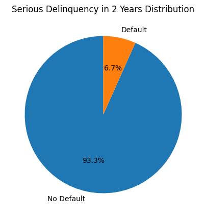 
      <em>Target distribution (6.7% default)</em>
    </td>
    <td align="center">
      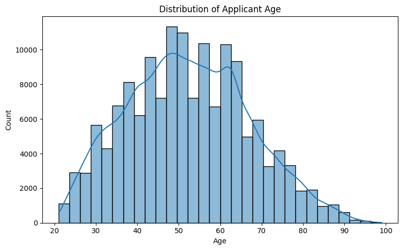 
      <em>Distribution of Applicant Age</em>
    </td>
  </tr>
  <tr>
    <td align="center">
      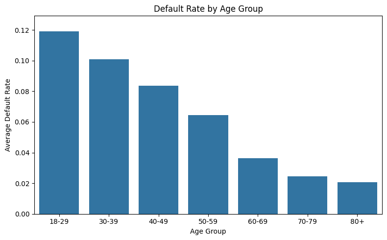 
      <em>Default rate by age group — risk declines with age</em>
    </td>
    <td align="center">
      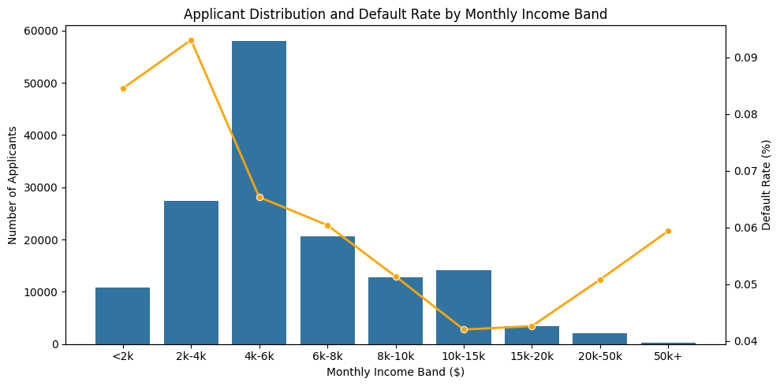 
      <em>Applicants & default by income band</em>
    </td>
  </tr>
  <tr>
    <td align="center">
      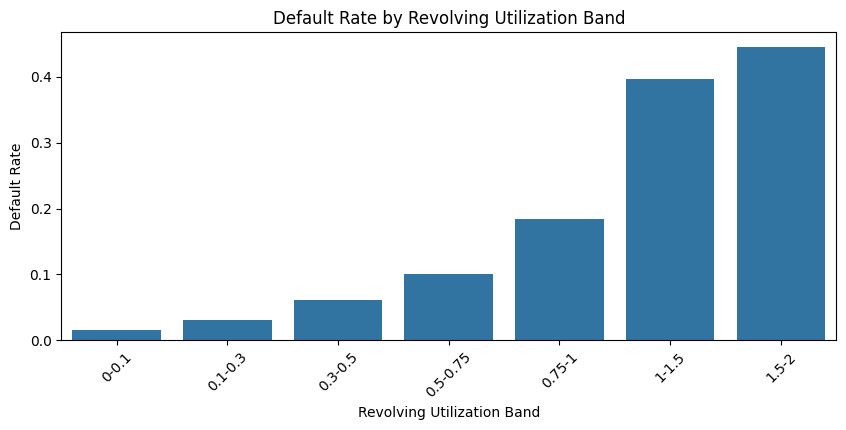 
      <em>Default rate by revolving utilisation</em>
    </td>
    <td align="center">
      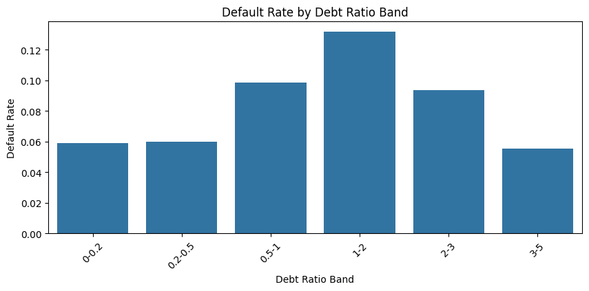 
      <em>Default rate by debt ratio band</em>
    </td>
  </tr>
  <tr>
    <td align="center">
      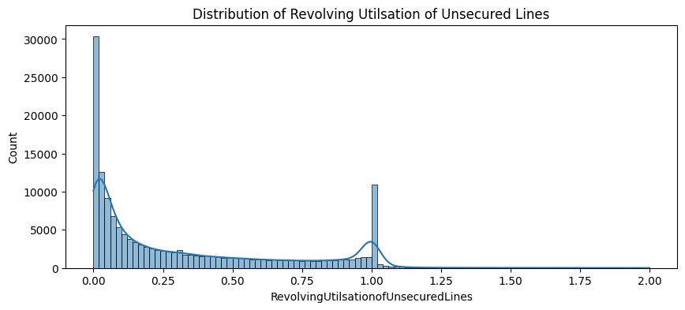 
      <em>Distribution of revolving utilisation (right-skewed)</em>
    </td>
    <td align="center">
      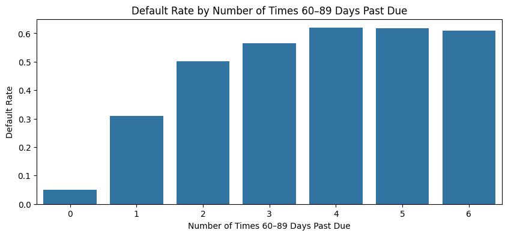 
      <em>Default rate by number of 90-day late events</em>
    </td>
  </tr>
</table>

---

### Feature Engineering
- Added delinquency-derived variable (`TotalDelinquencies`)
- Derived income stability indicator (`DependentsPerIncome`)

---

## Model Evaluation

The models were evaluated using multiple metrics to capture both discrimination and balance performance.  
Given the **high class imbalance** (only ~6.7% defaults), precision and recall are more informative than accuracy alone.

| Model | Precision | Recall | F1 | Accuracy | ROC-AUC |
|--------|------------|--------|------------|----------|----------|
| **Random Forest (CV)** | 0.615688 | 0.144719 | 0.233992 | 0.936533 | 0.862698 |
| **Random Forest (Test)** | 0.619932 | 0.147330 | 0.238080 | 0.937105 | 0.860421 |
| **XGBoost (CV)** | 0.601807 | 0.166800 | 0.260878 | 0.936676 | **0.864169** |
| **XGBoost (Test)** | 0.614815 | 0.166600 | **0.262160** | **0.937453** | 0.862600 |

<Figure size 1200x800 with 4 Axes>

**AUC-ROC & PR-AUC**

- XGBoost achieved a slightly higher ROC-AUC (0.863) compared to Random Forest (0.860), indicating stronger overall ranking ability.
- The Precision–Recall AUC (0.405 vs 0.398) also favors XGBoost, confirming better performance on the imbalanced target (defaults).
  
**Recall & F1-score**
  
- XGBoost captures more true defaulters (recall = 0.167) than Random Forest (recall = 0.147), while maintaining a similar precision.
- This leads to a higher F1-score, meaning XGBoost provides a better balance between precision and recall.
  
**Accuracy**
  
- Accuracy remains similar across models (~93.7%), but in imbalanced problems, accuracy is less meaningful than AUC or recall.

### Feature Importance — XGBoost Champion Model

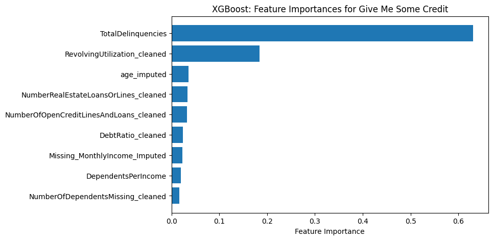

**Top Predictive Features (from the chart)**
| Rank | Feature                              | What it signals                                                                 |
|-----:|--------------------------------------|----------------------------------------------------------------------------------|
| 1    | `TotalDelinquencies`                 | Aggregated delinquency; strongest indicator of repayment risk.        |   
| 2    | `RevolvingUtilization_cleaned`       | Credit utilisation; High credit usage is a powerful distress indicator.  |
| 3    | `age_imputed`                        | Younger borrowers show higher default probability (stability/maturity effect).   |
| 4    | `NumberRealEstateLoansOrLines_cleaned` | Exposure to long-term secured credit; higher counts can raise obligations.     |
| 5    | `NumberOfOpenCreditLinesAndLoans_cleaned` | Indicates credit exposure, moderate levels are safer.                           |
| 6    | `DebtRatio_cleaned`                  | High ratios indicate leveraged households and repayment strain.               |
| 7    | `Missing_MonthlyIncome_Imputed`      | Income signal (and missingness) correlated with affordability risk.             |
| 8    | `DependentsPerIncome`                | Higher dependents often correlate with tighter household budgets.     |
| 9    | `NumberOfDependentsMissing_cleaned`  | Small contribution; weak signal compared to behaviour variables.                |

**Interpretation**
- `TotalDelinquencies` is the strongest feature it captures borrower past default history directly.
- `RevolvingUtilization_cleaned` is stong it shows how much revolving credit is being used; key in credit risk.
- **Portfolio actionables**: monitor customers with high `TotalDelinquencies` and **very high utilisation** for early-warning and capacity-building interventions.

### Key Takeaways

- **XGBoost** selected as the final production model due to stronger AUC and recall performance.  
- High accuracy reflects class imbalance, so **ROC-AUC and PR-AUC** were prioritized for model selection.  
- The model provides strong predictive separation between **low-risk** and **high-risk** applicants, supporting fairer and more data-driven lending decisions.

---

## Model Development

Algorithm: **XGBoost Classifier**

| Hyperparameter | Value |
|----------------|--------|
| `n_estimators` | 800 |
| `learning_rate` | 0.01 |
| `max_depth` | 4 |
| `subsample` | 0.6 |
| `colsample_bytree` | 0.8 |
| `gamma` | 0.2 |
| `min_child_weight` | 10 |
| `scale_pos_weight` | 1 |
| `reg_alpha` | 0.5 |
| `reg_lambda` | 1 |

---

## Decision Threshold Selection

**Chosen Threshold: 23% probability of financial distress**

The model outputs a probability between 0 and 1 representing the likelihood that a customer will experience financial distress within two years.  
By default, a threshold of **50%** is often used (classify as “default” if predicted probability ≥ 0.5), but this assumes:
- A balanced dataset, and  
- Equal business cost for false positives (rejecting good customers) and false negatives (approving future defaulters)

Given the **strong class imbalance (~6.7% defaults)**, a 0.5 cut-off would miss many real defaulters.  
To optimise business impact, we analysed the **Precision–Recall–Threshold** curve and selected the point that maximises the **F1-score** — the intersection of precision and recall.

---

### Threshold Optimisation

| Metric | Value |
|:--------|:------:|
| **Optimal Threshold** | **0.227 (~23%)** |
| **Precision** | **0.415** |
| **Recall** | **0.493** |
| **F1-score** | **0.451** |
| **Accuracy** | 0.920 |
| **AUC-ROC (threshold-independent)** | 0.721 |

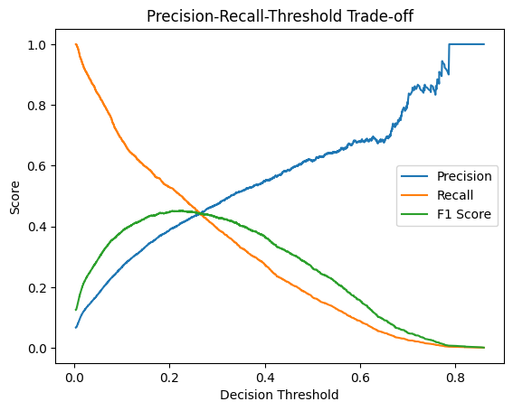

### Confusion Matrix (Test Set @ 0.23)

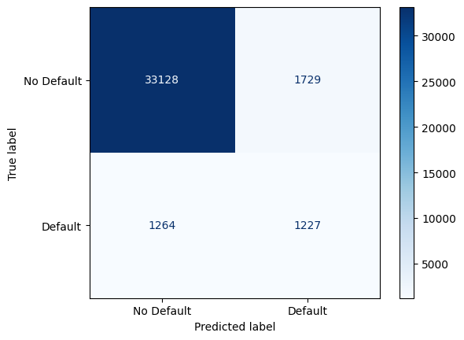

---

### Business Impact Simulation — 100,000 Applicants

Using the model at the **23 % threshold**, scaled from the test confusion matrix:

| **Actual \\ Predicted** | **No Default** | **Default (High Risk)** |
|--------------------------|:---------------:|:-----------------------:|
| **No Default** | 88,780 | 4,630 |
| **Default** | 3,390 | **3,290** |

**Key Insights**
- **7,920 applicants (≈ 8 %)** are flagged as **high risk** → sent for manual review or tighter credit limits.  
- The model **captures nearly half of all true defaulters**, preventing substantial portfolio losses.  
- **False positives (4.6 %)** represent cautious approvals — a prudent trade-off in credit underwriting.  
- **Missed defaulters (3.4 %)** can be managed through post-lending monitoring or early-warning triggers.  
- Reduces expected default losses by identifying risky applicants earlier in the pipeline.  
- Supports a credit policy that prioritises **risk detection over marginal approvals**, consistent with responsible-lending practices.

---

### Portfolio Default Rate Impact

By rejecting or reviewing applicants with ≥ 23 % predicted default probability,  
the model reduces the **portfolio default rate from 6.7 % to ≈ 3.7 %**,  
cutting expected credit losses by roughly **45 %** while maintaining approval access for **~92 %** of applicants  
(~89 % of which are genuinely low-risk).

---

### Summary Insight

- The **optimal 0.23 threshold** maximises operational utility — balancing recall and profitability.  
- Default detection improves substantially without severely restricting credit access.  
- This analytical framework enables data-driven **credit-strategy calibration** — the threshold can be raised or lowered to match changing risk appetite or macro-economic conditions.

---

### Next Steps

- **Add bureau and external features** (e.g., credit bureau scores, loan inquiries, payment history) to enrich predictive power and improve early-warning sensitivity.  
- **Calibrate probability outputs** to align model predictions with observed default rates, improving scorecard usability for policy cut-offs.  
- Implement **SHAP-based interpretability** to explain individual applicant decisions and enhance fairness and transparency.  
- **Monitor portfolio performance** post-deployment — track drift, re-train thresholds as macroeconomic or behavioural patterns evolve.  
- Explore **profit-based optimisation** (Expected Loss or Cost–Benefit metrics) to link model outcomes directly to financial impact.

---

## Kaggle Leaderboard Score

The final XGBoost submission achieved a **ROC–AUC of 0.864**, placing in the top percentile of participants for the *Give Me Some Credit* competition.

  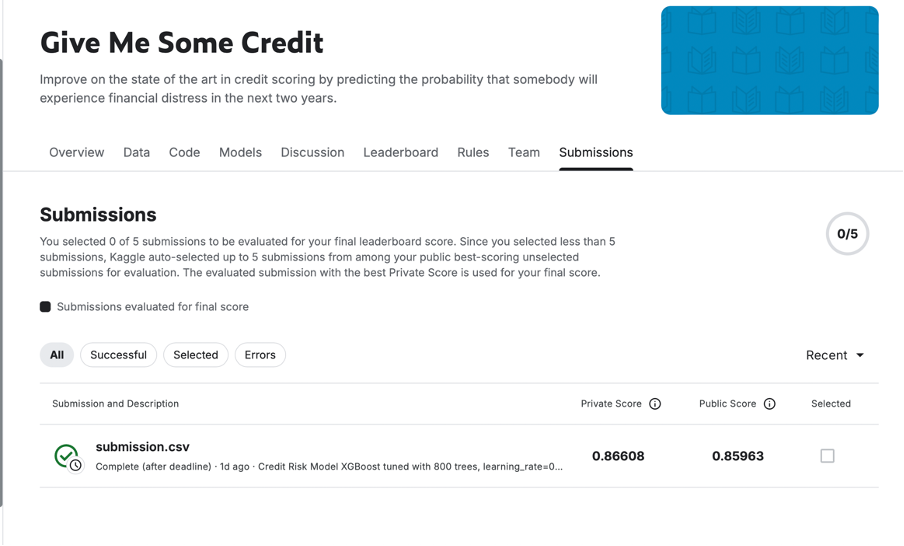

---

## Repository Structure

MIT — see [LICENSE](LICENSE).
